## Architecture

### System Overview

### Key Components

1. Client Applications
  - User mobile app
  - Driver mobile app
  - Administrative web interface
2. AWS Infrastructure
  - API Gateway for REST endpoints
  - WebSocket API for real-time updates (TBD)
  - Lambda functions for business logic
  - DynamoDB for real-time data
  - PostgreSQL for persistent storage
3. External Services (TBD)
  - Payment processing
  - Geographical services
4. Security & Authentication
  - AWS Cognito handles user authentication
  - Role-based access control for users, drivers, and admins
  - Secure token-based API access
  - Request signing for WebSocket connections

### Data Flow

1. Clients make requests to API Gateway endpoints
2. API Gateway authenticates and routes to appropriate Lambda
3. Lambda functions process requests and interact with databases
4. Real-time data flows through DynamoDB
5. Persistent data is stored in PostgreSQL
